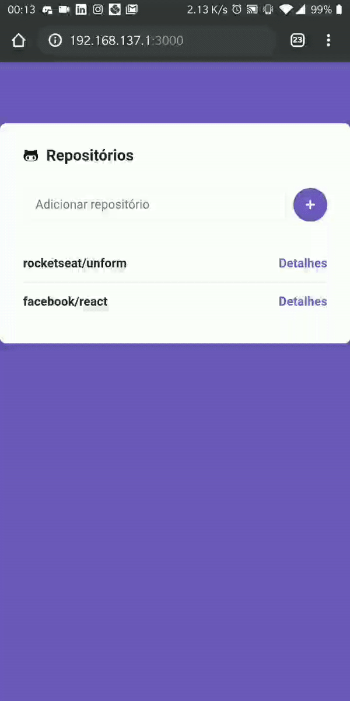
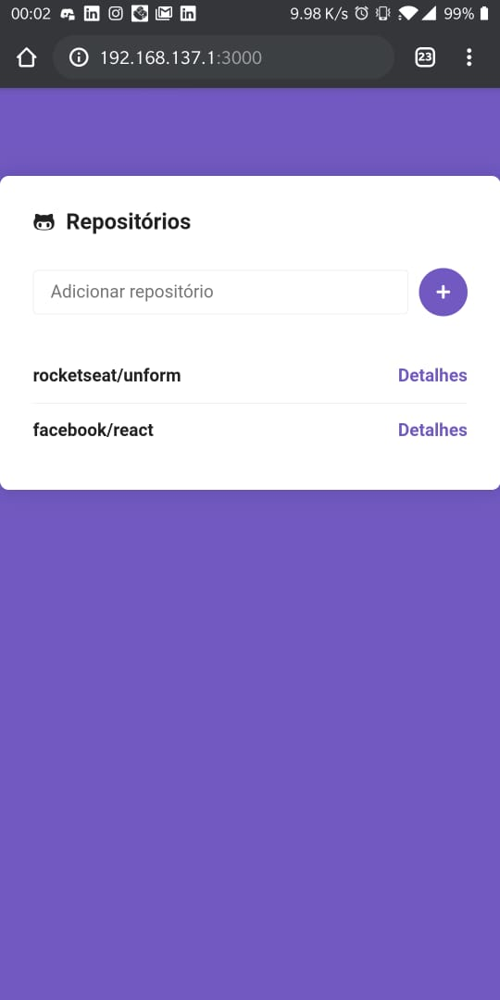
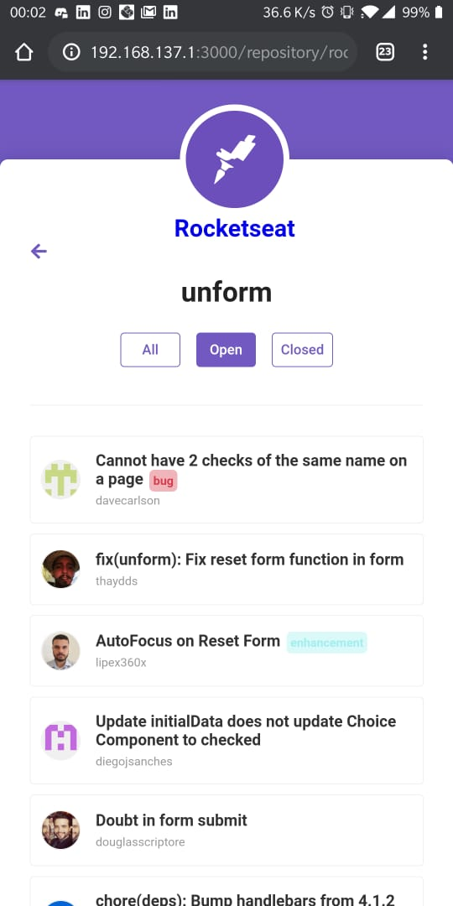
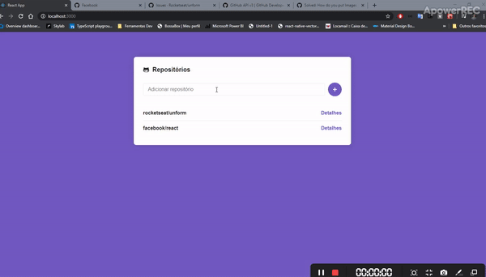
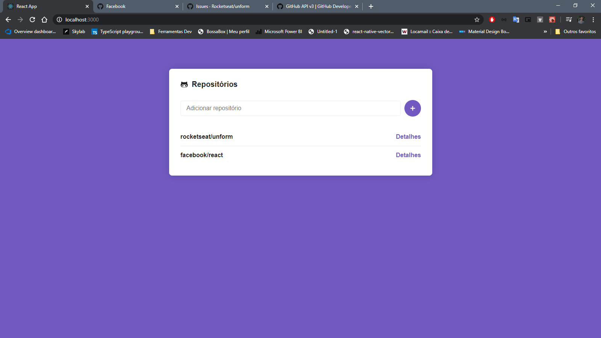
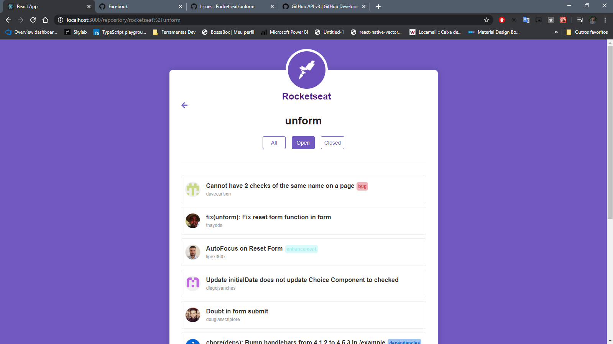

<h1 align="center">
    
</h1>

<h3 align="center">
  Desafio 5: Primeiro projeto com ReactJS
</h3>

  <a href="#rocket-sobre-o-desafio">Sobre o desafio</a>&nbsp;&nbsp;&nbsp;|&nbsp;&nbsp;&nbsp;
  <a href='#gear-oque-foi-utilizado'>Oque foi utilizado</a>&nbsp;&nbsp;&nbsp;|&nbsp;&nbsp;&nbsp;
  <a href="#camera-imagens">Imagens</a>

## :rocket: Sobre o desafio

Desenvolver uma aplicação utilizando reactJS.

## :gear: Oque foi utilizado
<ul>
  <li>React hooks</li>
  <li>Styled Components</li>
  <li>Api do github</li>
  <li>Axios</li>
</ul>

## :camera: Imagens

### Celular

  
  

### Desktop

  
  

